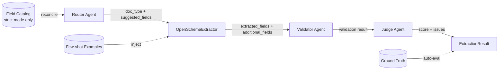

# Configurable Document Extraction

FastAPI backend plus a separate React frontend for AI-assisted document extraction with a Router Agent, a single open-schema extractor, a Validator Agent, and an OpenRouter (nvidia/nemotron-nano-12b-v2-vl:free)-powered LLM Judge.

## Architecture



The Router classifies the document and proposes fields; a single generic
`OpenSchemaExtractor` extracts whatever fields it can find guided by that
suggestion list (no more hardcoded per-type extractors). In `SCHEMA_MODE=strict`,
the Router additionally reconciles its suggestions against the on-disk field
catalog (invoice / po / delivery_note). The Validator never hard-blocks a
document on its own — only a completely empty extraction, or missing fields the
Router flagged `likely_required`, affect `needs_review`. The Judge does a final
LLM-based sanity check against the source text/image. If a ground-truth file
matching the uploaded filename exists in the knowledge base, an automatic
precision/recall/F1 evaluation is attached to the result.

## Tech Stack

- React frontend
- FastAPI backend
- RAG-ready knowledge base layout
- Multi-agent orchestration layer (Router → Extractor → Validator → Judge)
- Pydantic schemas
- OpenRouter (nvidia/nemotron-nano-12b-v2-vl:free) via an OpenAI-compatible client
- `.env`-driven configuration

## Project Layout

- `app/main.py` FastAPI entry point
- `app/core/config.py` backend environment settings
- `app/api/routes.py` API endpoints
- `app/agents/` router, extractor, validator, judge
- `app/services/` orchestration, jobs, knowledge base
- `app/schemas/` Pydantic models
- `app/data/knowledge_base/` sample KB structure
- `frontend/` React UI that calls the backend API

## Data Layer

- No persistent database is configured yet.
- Batch jobs currently use the in-memory job store in `app/services/job_store.py`.
- The knowledge base is file-backed under `app/data/knowledge_base/`.

## Environment

Copy `.env.example` to `.env` if you want to change defaults.

### Schema Mode Selection
The system supports two runtime modes controlled by the `SCHEMA_MODE` environment variable:
- `"strict"` (default): Restores the original 3-document-type specification (invoice, purchase_order, delivery_note) with strict validation. If a required catalog field is missing or format checks (dates, amounts) fail, validation fails (`is_valid = False`, `severity = "error"`) and flags the document for review.
- `"open"`: Retains the open-schema architecture where `doc_type` is free-form and validation is soft/informational (warnings only, does not block the document).

Important variables:

- `APP_NAME`
- `APP_ENV`
- `APP_HOST`
- `APP_PORT`
- `SCHEMA_MODE` (values: `"strict"` or `"open"`, default: `"strict"`)
- `SUPPORTED_DOC_TYPES`
- `SUPPORTED_LANGUAGES`
- `KNOWLEDGE_BASE_PATH`
- `FEW_SHOT_EXAMPLES_PER_DOC_TYPE`
- `JUDGE_MODEL_NAME`
- `OPENROUTER_API_KEY`
- `FRONTEND_ORIGINS`

Frontend environment:

- copy `frontend/.env.example` to `frontend/.env`
- set `VITE_API_BASE_URL` to your FastAPI backend URL

## API Contract

- `POST /extract` upload file(s) and return extraction result(s)
- `GET /templates` list supported document types and schemas
- `POST /extract/batch` create async batch job
- `GET /jobs/{id}` check batch status and results
- `POST /evaluate` evaluate prediction against ground truth

## Run

Minimum requirements:

- Python 3.10+ and pip
- Node.js 16+ (for the frontend) and npm/yarn/pnpm

1) Backend (FastAPI)

- Copy environment example: `cp .env.example .env` and edit values as needed (notably `OPENROUTER_API_KEY` and `FRONTEND_ORIGINS`).
- Create and activate a virtualenv (recommended):

	```bash
	python -m venv .venv
	source .venv/bin/activate
	```

- Install Python dependencies:

	```bash
	pip install -r requirements.txt
	```

- Run the backend:

	```bash
	python -m uvicorn app.main:app --reload --host 127.0.0.1 --port 8000
	```

2) Frontend (React / Vite)

- Change to the frontend folder and copy the env example:

	```bash
	cd frontend
	cp .env.example .env
	```

- Install JS deps and start the dev server:

	```bash
	npm install
	npm run dev
	```

3) Open in your browser

- Frontend UI (Vite dev server): `http://127.0.0.1:5173/`
- Backend API root: `http://127.0.0.1:8000/`
- Swagger docs: `http://127.0.0.1:8000/docs`

4) Quick troubleshooting

- If you see errors about missing API keys, set `OPENROUTER_API_KEY` (or other provider keys) in `.env` or set to an empty string for local testing.
- Check backend logs in the terminal where `uvicorn` runs for tracebacks.
- If frontend cannot reach the backend, ensure `VITE_API_BASE_URL` in `frontend/.env` points to `http://127.0.0.1:8000` and `FRONTEND_ORIGINS` in the backend `.env` allows the origin.

## CI

`.github/workflows/ci.yml` runs on every push/PR to `main`:
- **Backend**: Ruff lint + `pytest Backend/tests/`
- **Frontend**: `npm run build` (type-checks via `tsc -b`, then builds)

`.github/workflows/sonarcloud.yml` runs static code analysis separately.
