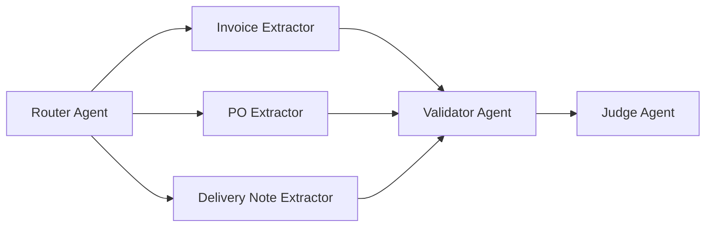

# Configurable Document Extraction

FastAPI scaffold for AI-assisted document extraction with a Router Agent, three specialist extractors, a Validator Agent, and an LLM Judge.

## Architecture



## Tech Stack

- FastAPI
- RAG-ready knowledge base layout
- Multi-agent orchestration layer
- Pydantic schemas
- LLM Judge stub
- `.env`-driven configuration

## Project Layout

- `app/main.py` FastAPI entry point
- `app/core/config.py` environment settings
- `app/api/routes.py` API endpoints and landing page
- `app/agents/` router, extractors, validator, judge
- `app/services/` orchestration, jobs, knowledge base
- `app/schemas/` Pydantic models
- `app/data/knowledge_base/` sample KB structure

## Environment

Copy `.env.example` to `.env` if you want to change defaults.

Important variables:

- `APP_NAME`
- `APP_ENV`
- `APP_HOST`
- `APP_PORT`
- `SUPPORTED_DOC_TYPES`
- `SUPPORTED_LANGUAGES`
- `KNOWLEDGE_BASE_PATH`
- `FEW_SHOT_EXAMPLES_PER_DOC_TYPE`
- `JUDGE_MODEL_NAME`

## API Contract

- `POST /extract` upload file and return extraction result
- `GET /templates` list supported document types and schemas
- `POST /extract/batch` create async batch job
- `GET /jobs/{id}` check batch status and results
- `POST /evaluate` evaluate prediction against ground truth

## Run

Install dependencies:

```bash
pip install -r requirements.txt
```

Start the app:

```bash
uvicorn app.main:app --reload
```

Open:

- Home page: `http://127.0.0.1:8000/`
- API docs: `http://127.0.0.1:8000/docs`