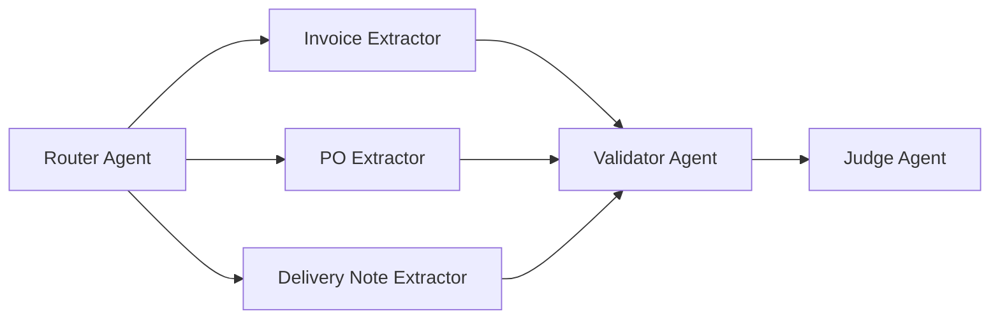

# Configurable Document Extraction

FastAPI backend plus a separate React frontend for AI-assisted document extraction with a Router Agent, three specialist extractors, a Validator Agent, and a Gemini-powered LLM Judge.

## Architecture



## Tech Stack

- React frontend
- FastAPI backend
- RAG-ready knowledge base layout
- Multi-agent orchestration layer
- Pydantic schemas
- Gemini LLM Judge
- `.env`-driven configuration

## Recommended Model

- Best extraction choice from the provided model list: `Gemini 3.1 Pro Preview`
- Fallback choice if you want a more stable non-preview option: `Gemini 2.5 Pro`
- The app now surfaces this recommendation in the API root and in the frontend demo header

## Demo Criteria

The frontend demo now covers these acceptance criteria:

1. Mixed batch upload of 3 document types
2. Router classification plus per-type extraction output
3. Intentional bad document that triggers validation and judge flags
4. Evaluation dashboard with precision, recall, and F1 metrics

## Image Upload Support

- The upload flow now accepts image files such as `.png`, `.jpg`, `.jpeg`, `.webp`, `.gif`, `.bmp`, `.tif`, and `.tiff`
- The frontend runs OCR on image files before upload and sends the recognized text to the backend
- The backend still keeps a Gemini OCR fallback for image uploads if client-side OCR is unavailable
- A valid `GEMINI_API_KEY` improves the fallback path, but the browser OCR path works without it

## Project Layout

- `app/main.py` FastAPI entry point
- `app/core/config.py` backend environment settings
- `app/api/routes.py` API endpoints
- `app/agents/` router, extractors, validator, judge
- `app/services/` orchestration, jobs, knowledge base
- `app/schemas/` Pydantic models
- `app/data/knowledge_base/` sample KB structure
- `frontend/` React UI that calls the backend API

## Data Layer

- No persistent database is configured yet.
- Batch jobs currently use the in-memory job store in `app/services/job_store.py`.
- The knowledge base is file-backed under `app/data/knowledge_base/`.

## Environment

Copy `.env.example` to `.env` if you want to change defaults.

Important variables:

- `APP_NAME`
- `APP_ENV`
- `APP_HOST`
- `APP_PORT`
- `SUPPORTED_DOC_TYPES`
- `SUPPORTED_LANGUAGES`
- `KNOWLEDGE_BASE_PATH`
- `FEW_SHOT_EXAMPLES_PER_DOC_TYPE`
- `JUDGE_MODEL_NAME`
- `GEMINI_API_KEY`
- `FRONTEND_ORIGINS`

Frontend environment:

- copy `frontend/.env.example` to `frontend/.env`
- set `VITE_API_BASE_URL` to your FastAPI backend URL

## API Contract

- `POST /extract` upload file and return extraction result
- `GET /templates` list supported document types and schemas
- `POST /extract/batch` create async batch job
- `GET /jobs/{id}` check batch status and results
- `POST /evaluate` evaluate prediction against ground truth using the configured judge model

## Run

Install dependencies:

```bash
pip install -r requirements.txt
```

Start the app:

```bash
python -m uvicorn app.main:app --reload
```


Open:

- Frontend: `http://127.0.0.1:5173/`
- Backend API root: `http://127.0.0.1:8000/`
- API docs: `http://127.0.0.1:8000/docs`