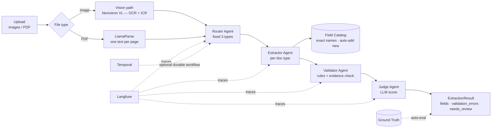

# Architecture

## Pipeline stages

| Stage | Type | Purpose |
|---|---|---|
| Parse | deterministic | Images bypass OCR (sent directly to the VL model = OCR + ICR); PDFs are split per page by LlamaParse. One result per page → multi-document PDFs work. |
| Router | LLM | Classifies into exactly `invoice` / `purchase_order` / `delivery_note`. |
| Extractor | LLM ×3 | One agent per doc type. Prompt embeds the COMPACT field catalog. Output is JSON-schema-constrained. |
| Catalog | deterministic | Field names matched EXACTLY (normalization only, never aliases). Unknown labeled fields are appended to `field_catalog/<type>_fields.json` with `source=ai_discovered`. |
| Validator | deterministic | Required fields, empty values, date parsing, evidence (`source_span` must appear in the document), low-confidence flags → `validation_errors`, `needs_review`. |
| Judge | LLM | Scores extraction 0–1 against the source image/text; score < 0.7 → `needs_review`. |
| Auto-eval | deterministic | When the filename matches a `ground_truth/*.json`, precision/recall/F1 is attached. |

## Security model

1. **Prompt injection**: all document text passes `core/security.py::sanitize_document_text`
   (instruction patterns redacted, role tags stripped, length-capped) before entering any prompt.
2. **Hallucination**: `check_evidence` verifies each value's `source_span` overlaps the
   document (≥75% token overlap or substring). Missing/foreign evidence → validation error.
3. **Fixed schema**: LLM responses are parsed into Pydantic models via the
   3-tier structured-output client (json_schema → json_object → repair prompt).

## Token minimization

- Compact catalog in prompts (name + type + required, one line each).
- Few-shot examples OFF by default (`FEW_SHOT_EXAMPLES_PER_DOC_TYPE=0`), capped at ~2k chars when on.
- Reasoning disabled on all pipeline calls; extraction capped by `EXTRACTION_MAX_TOKENS`.
- Document text sanitized AND truncated (12k chars) before prompts.
