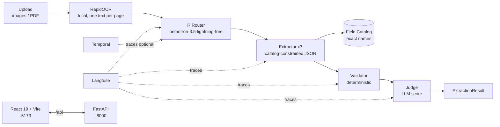

# Tech Stack & What This Project Does

> Last updated: 2026-09-07. Single source for "what does this project do and what is it built with".

## 1. What this project does

**Configurable Document Extraction** extracts structured JSON from scanned / photographed business documents.

* **Fixed 3 document types:** `invoice`, `purchase_order`, `delivery_note` (enforced end-to-end by Pydantic `Literal`).
* **Upload anything:** images (PNG/JPG) + PDFs. One PDF may contain several documents — **each page becomes its own `ExtractionResult`**.
* **Pipeline (per page):**
  ```text
  Upload → RapidOCR (local text) → Router (classify 1 of 3)
    → Extractor (per doc type) → Field Catalog (exact match / auto-add)
    → Validator (rules + evidence) → Judge (LLM score) → ExtractionResult
  ```
* **Core result shape** (`api/app/schemas/documents.py`):
  ```python
  class ExtractedField(BaseModel):
      name: str
      value: str | float | date | None
      confidence: float
      source_span: str | None  # quoted evidence from document text

  class ExtractionResult(BaseModel):
      doc_type: Literal["invoice", "purchase_order", "delivery_note"]
      fields: list[ExtractedField]
      validation_errors: list[str]
      needs_review: bool
  ```
* **Key product rules:**
  1. Field names come from `api/app/data/knowledge_base/field_catalog/*.json`. Matching is EXACT (case/underscore normalization only). No aliases/synonyms. Unknown labeled values are ADDED to the catalog with `source: ai_discovered`.
  2. Every field must carry `source_span` + `confidence`. Missing evidence or low confidence → `needs_review = true`.
  3. All document text passes `sanitize_document_text` before any LLM call (prompt-injection guard).
  4. Token-minimized: compact catalog prompts, few-shot OFF by default (`FEW_SHOT_EXAMPLES_PER_DOC_TYPE=0`), reasoning disabled.
  5. Evaluate tab: score predictions vs `ground_truth/*.json` (precision / recall / F1 + mismatch table).

## 2. Tech stack overview

| Layer | Tech | Purpose / Notes |
|---|---|---|
| **Backend API** | `FastAPI >=0.115` + `uvicorn[standard] >=0.30` | REST under `/api`: `POST /api/extract`, `GET /api/templates`, `POST /api/evaluate`, `POST /api/extract/batch` + `GET /api/jobs/{id}`. Run from `api/` so `.env` + `app` package resolve. |
| **Contracts** | `Pydantic >=2.7` | `app/schemas/` — API + internal types. Single source of truth. |
| **Config / Upload** | `python-dotenv >=1.0`, `python-multipart >=0.0.9` | Env-driven `Settings` (`app/core/config.py`); multipart file uploads, `MAX_UPLOAD_MB=10`. |
| **LLM transport** | `openai >=1.40` (OpenAI-compatible) | Talks to **OpenCode Zen gateway** (`https://opencode.ai/zen/v1`) via `app/services/sut_genai_client.py`. 3-tier structured output: `json_schema` → `json_object` → repair prompt + retries. |
| **LLM model** | `nemotron-3.5-lightning-free` (text-only) | Single model for Router + Extractor + Judge (env overridable per stage). No vision model required. Free tier key = `public`. |
| **OCR (local)** | `rapidocr_onnxruntime==1.2.3`, `pymupdf>=1.24`, `pillow>=10.0`, `numpy>=1.26` | All uploads OCR'd on-host (ONNX, CPU, offline, ~1s/page). PDFs rendered at `OCR_DPI=300` via PyMuPDF. Wrapper: `app/services/rapidocr_client.py`. SHA-256 in-memory cache. See `docs/local_ocr.md`. |
| **Workflow** | `temporalio>=1.7` | Optional durable workflow `parse → classify → extract → validate → judge` (`app/temporal/`). Default `TEMPORAL_ENABLED=false` = in-process pipeline. |
| **Observability** | `langfuse>=4.0` (SDK v4) | One trace `extract-document` per page with `classify-document` / `extract-fields` / `validate-fields` / `judge-extraction` children. No-op without keys. See `docs/langfuse_tracing.md`. |
| **Frontend** | `React ^19.1.0`, `react-dom ^19.1.0`, `TypeScript ^5.9.2`, `Vite ^7.0.4`, `@vitejs/plugin-react ^5.0.2` | SPA under `web/src/` (`api/`, `components/`, `hooks/`, `types/`, `utils/`). `npm run dev` → `:5173`, `npm run build` = `tsc -b && vite build`. Dev proxy `/api → 127.0.0.1:8000`. |
| **Styling** | Vanilla CSS (`web/src/styles.css`), no UI lib | Palette only: `#CBCBCB`, `#F2F2F2`, `#174D38` (primary), `#4D1717` (danger). Light/dark via CSS vars + `localStorage`. |
| **KB / Retrieval** | JSON files + stdlib TF-IDF (`rag_retriever.py`) | `field_catalog/`, `few_shot/`, `ground_truth/`, `documents/`. No vector DB. See `docs/rag_kb.md`. |
| **Quality** | `pytest`, `pytest-asyncio`, `anyio`, `ruff` | `ruff check` (`ruff.toml`, `py311`, line-length 120) + `pytest api/tests/ -q` + `cd web && npm run build`. CI: `.github/workflows/ci.yml` + SonarCloud. |
| **Runtime reqs** | `Python 3.11+`, `Node 18+` | One-command setup+run: `./scripts/run_all.sh` → API `:8000` + Web `:5173`. |
| **Deploy** | Vercel (web) + Render/Railway/Fly.io (API) | Web root = `web/`, `VITE_API_BASE_URL=<backend>/api`. Backend start: `pip install -r api/requirements.txt && cd api && uvicorn app.main:app`. |

## 3. How the pieces fit



* **Backend modules:** see `docs/backend.md` — `agents/` (router/extractors/validator/judge), `core/` (config/security), `services/` (orchestration/LLM/catalog/KB/OCR), `observability/`, `temporal/`, `api/routes.py`.
* **Frontend modules:** see `docs/frontend.md` — `Sidebar` (dropzone+queue), `ExtractionTab` (fields+confidence+source_span), `EvaluationTab` (F1/mismatches), `PipelineStepper`, `hooks/useDocumentQueue|useEvaluation`.
* **Security:** `sanitize_document_text` redacts instruction patterns/role tags + length-caps; `check_evidence` requires ≥75% token overlap or substring.
* **Tokens:** compact catalog (name+type+required per line), 12k char text cap, `ROUTER_TEXT_CHARS=2000`, `EXTRACTION_MAX_TOKENS=3000`, `JUDGE_SKIP_WHEN_CLEAN=true`.

## 4. Run it

```bash
./scripts/run_all.sh
# UI  http://localhost:5173
# API http://127.0.0.1:8000/docs
```

```bash
source .venv/bin/activate
ruff check api/ && python -m pytest api/tests/ -q
cd web && npm run build
```

Config: copy `api/.env.example → api/.env` (`OPENCODE_API_KEY`, `OCR_DPI`, Langfuse, `TEMPORAL_ENABLED`). Frontend `web/.env`: `VITE_API_BASE_URL=http://localhost:8000/api` (the `/api` suffix is required).
