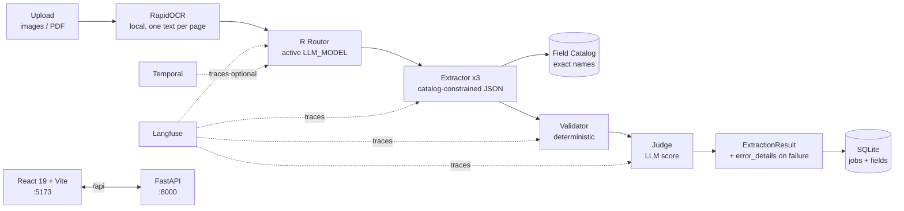

# Tech Stack & What This Project Does

> Last updated: 2026-09-08. Single source for "what does this project do and what is it built with".

## 1. What this project does

**Configurable Document Extraction** extracts structured JSON from scanned / photographed business documents.

* **Fixed 3 document types:** `invoice`, `purchase_order`, `delivery_note` (enforced end-to-end by Pydantic `Literal`).
* **Upload anything:** images (PNG/JPG) + PDFs. One PDF may contain several documents — **each page becomes its own `ExtractionResult`**.
* **Pipeline (per page):**
  ```text
  Upload → RapidOCR (local text) → Router (classify 1 of 3)
    → Extractor (per doc type) → Field Catalog (exact match / auto-add)
    → Validator (rules + evidence) → Judge (LLM score) → ExtractionResult
  ```
* **Core result shape** (`api/app/schemas/documents.py`):
  ```python
  class ExtractedField(BaseModel):
      name: str
      value: str | float | date | None
      confidence: float
      source_span: str | None  # quoted evidence from document text

  class ProviderErrorDetails(BaseModel):
      stage: str | None       # router | extractor | judge
      provider: str | None    # e.g. opencode
      model: str | None
      status: int | None      # HTTP status from gateway
      code: str | None        # gateway error code (e.g. model_not_found)
      message: str | None     # redacted gateway message
      request_id: str | None

  class ExtractionResult(BaseModel):
      doc_type: Literal["invoice", "purchase_order", "delivery_note"]
      fields: list[ExtractedField]
      validation_errors: list[str]
      needs_review: bool
      completeness_score: float  # 0.0 on stage failure, never false 100%
      failed_stage: Literal["router", "extractor", "validator", "judge"] | None
      error_details: ProviderErrorDetails | None  # redacted, shown in UI <details>
  ```
* **Async jobs:** `POST /api/extract` returns `202 {job_id, status: queued}` immediately; the client polls `GET /api/jobs/{job_id}` until `completed`/`failed`. Jobs persist in SQLite (`data/extraction.db`, relative to `api/`); schema auto-migrates on boot (`PRAGMA table_info` check) and writes degrade gracefully on old DB files.
* **Key product rules:**
  1. Field names come from `api/app/data/knowledge_base/field_catalog/*.json`. Matching is EXACT (case/underscore normalization only). No aliases/synonyms. Unknown labeled values are ADDED to the catalog with `source: ai_discovered`.
  2. Every field must carry `source_span` + `confidence`. Missing evidence or low confidence → `needs_review = true`.
  3. All document text passes `sanitize_document_text` before any LLM call (prompt-injection guard).
  4. Token-minimized: compact catalog prompts, few-shot OFF by default (`FEW_SHOT_EXAMPLES_PER_DOC_TYPE=0`), reasoning disabled.
  5. Evaluate tab: score predictions vs `ground_truth/*.json` (precision / recall / F1 + mismatch table).

## 2. Tech stack overview

> Full tools reference (versions, files, config knobs): [`docs/tech-stack/tools.md`](tech-stack/tools.md).

FastAPI + Pydantic backend (`:8000`), one OpenAI-compatible text model
across 11 providers (`LLM_PROVIDER` / `LLM_API_KEY` / `LLM_MODEL`),
local RapidOCR, SQLite job store, optional Temporal + Langfuse, React
19 + Vite frontend (`:5173`), JSON-file knowledge base, `ruff` + `pytest`
+ `tsc` quality gates. One command runs it all: `./scripts/run_all.sh`.

## 3. How the pieces fit



* **Backend modules:** see `docs/backend.md` (+ `docs/services.md`, `docs/api.md`, `docs/async_jobs.md`, `docs/database.md`).
* **Frontend modules:** see `docs/frontend.md` (+ `docs/frontend_helpers.md`).
* **LLM / providers / errors:** see `docs/ai_provider.md`, `docs/provider_errors.md`, `docs/llm_request_queue.md`.
* **Full tools reference:** [`docs/tech-stack/tools.md`](tech-stack/tools.md).
* **Security:** `sanitize_document_text` redacts instruction patterns/role tags + length-caps; `check_evidence` requires ≥75% token overlap or substring; provider messages are redacted so keys never reach UI/DB.
* **Tokens:** compact catalog (name+type+required per line), 12k char text cap, `ROUTER_TEXT_CHARS=2000`, `ROUTER_MAX_TOKENS=400`, `EXTRACTION_MAX_TOKENS=3000`, `JUDGE_SKIP_WHEN_CLEAN=true`.

## 4. Run it

```bash
./scripts/run_all.sh
# UI  http://localhost:5173
# API http://127.0.0.1:8000/docs
```

```bash
source .venv/bin/activate
ruff check api/ && python -m pytest api/tests/ -q
cd web && npm run build
```

Config: copy `api/.env.example → api/.env` (`LLM_PROVIDER`, `LLM_API_KEY`, `LLM_MODEL`, `OCR_DPI`, Langfuse, `TEMPORAL_ENABLED`). Frontend `web/.env`: `VITE_API_BASE_URL=http://localhost:8000/api` (the `/api` suffix is required).
